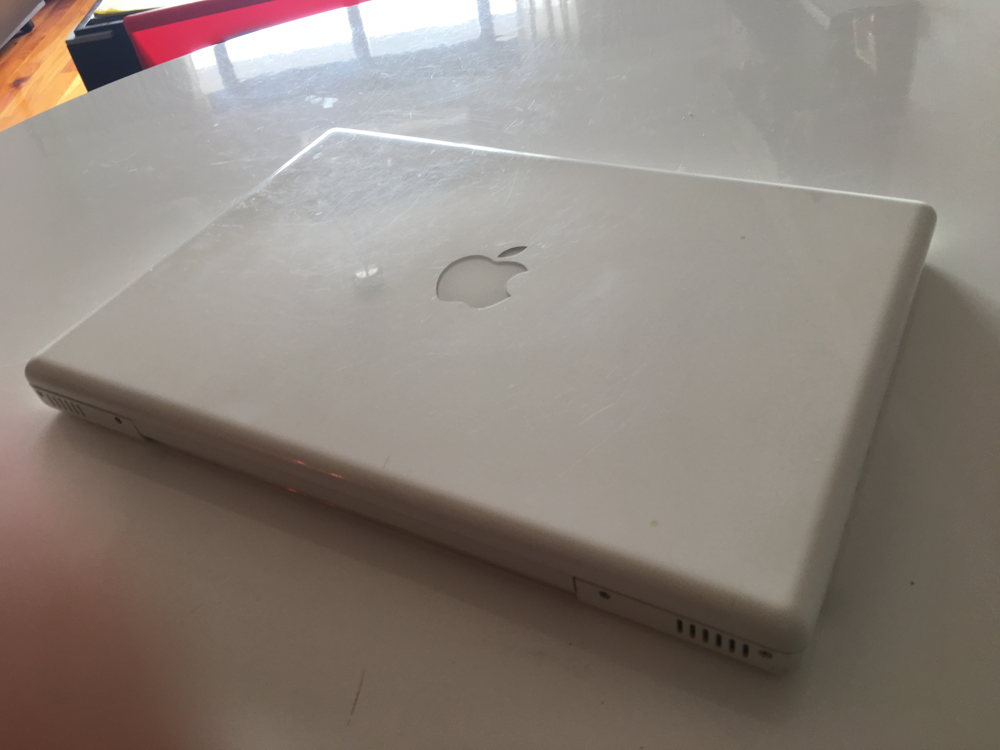
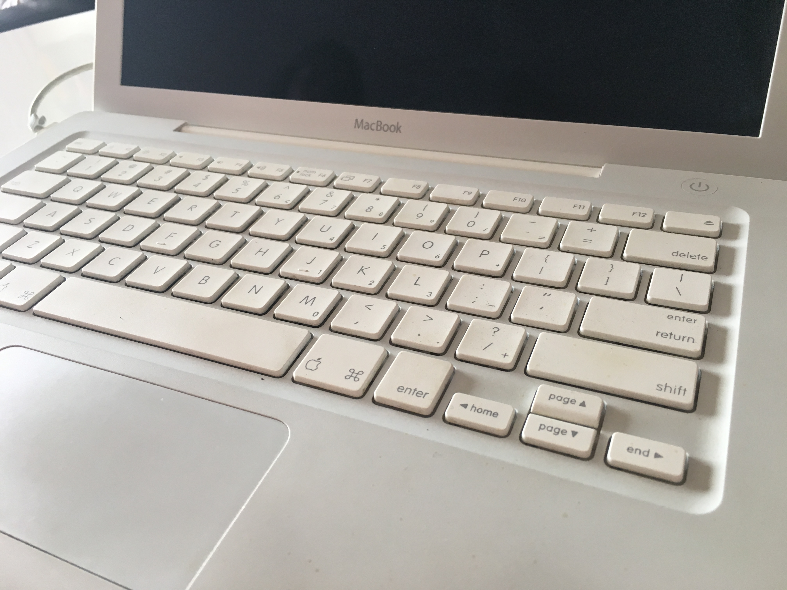
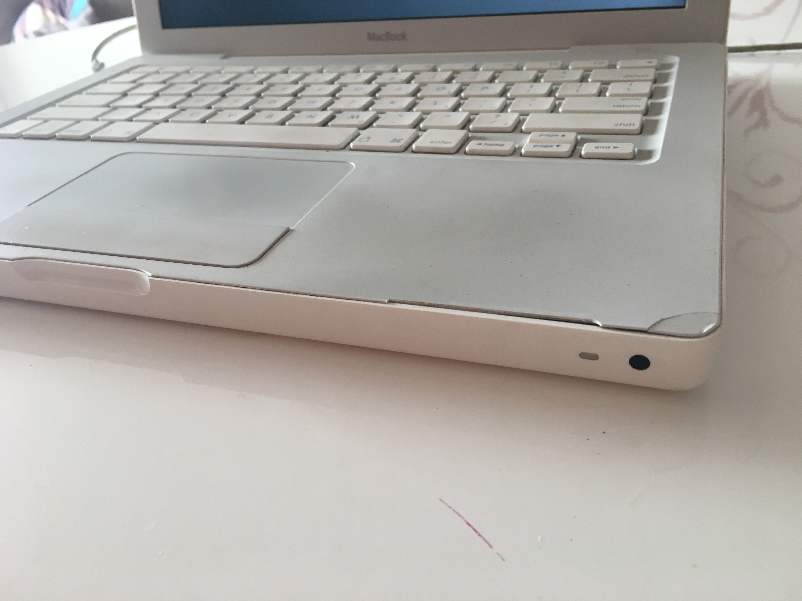
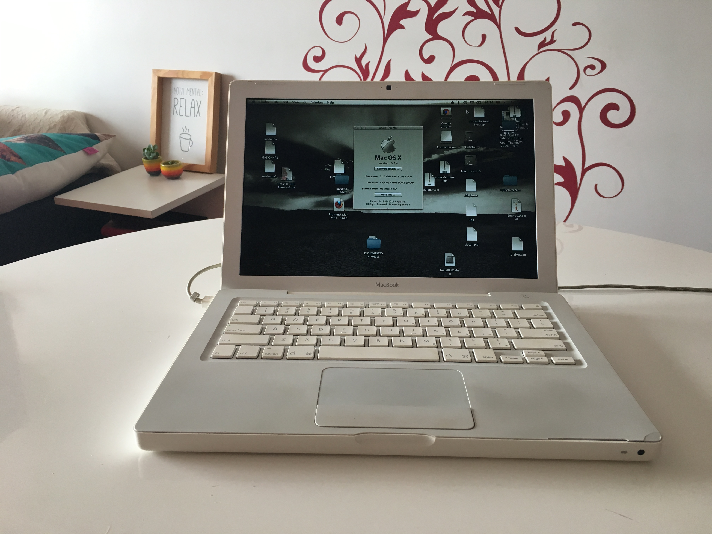
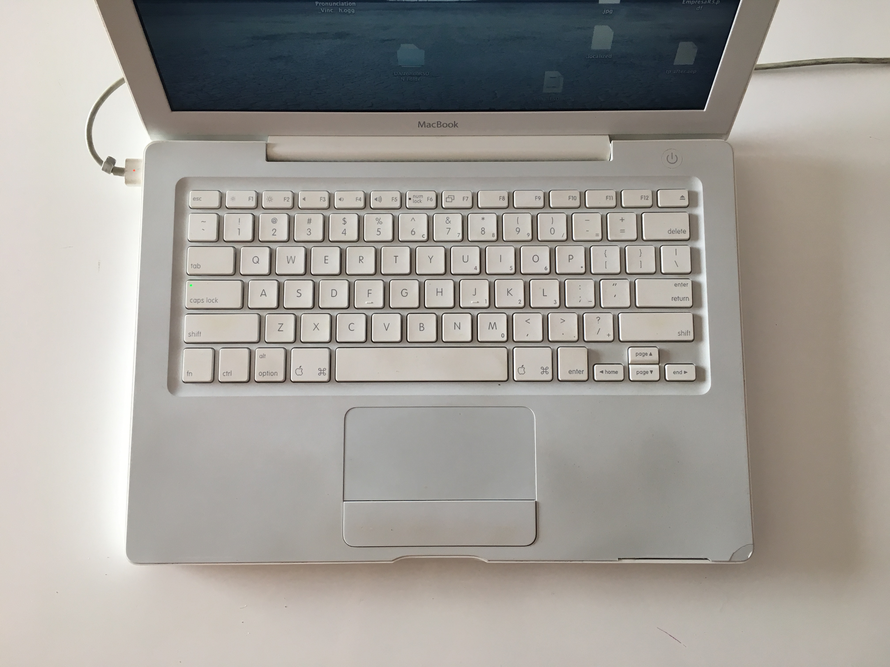
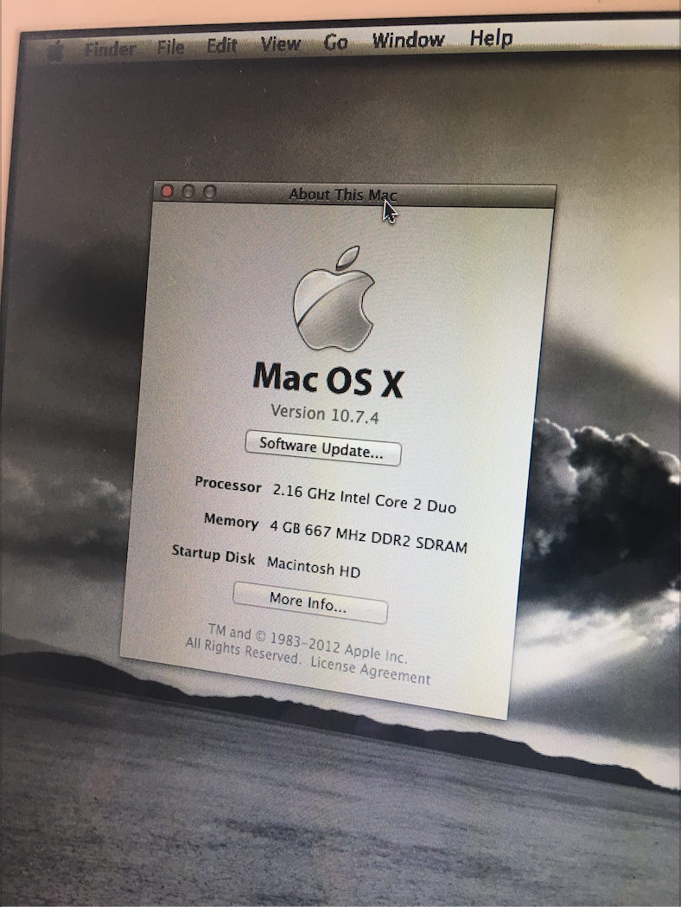

## Macbook

Modelo 13-inch Mid 2007 (comprada en 2008). Viene con cargador y batería todavía con vida útil le dura entre 3 y 5hs (fue cambiada por una genérica hace unos años).

Info del sistema:

**Process**  2.16 GHz Intel Core 2 Duo  
**Memory**  4 GB 667 MHz DDR2 SDRAM  - Venía con 2 y lo upgradeé, difícil conseguir esta máquina con 4GB  
**Graphics**  Intel GMA 950 64 MB  
**Software**  Mac OS X Lion 10.7.4 (11E53) (upgradeble a 10.7.5)  
**Disco**: 120GB

Tiene un par de detalles por el uso como se ve en las fotos, pero sacando eso funca de primera.

💰 **$5000**

